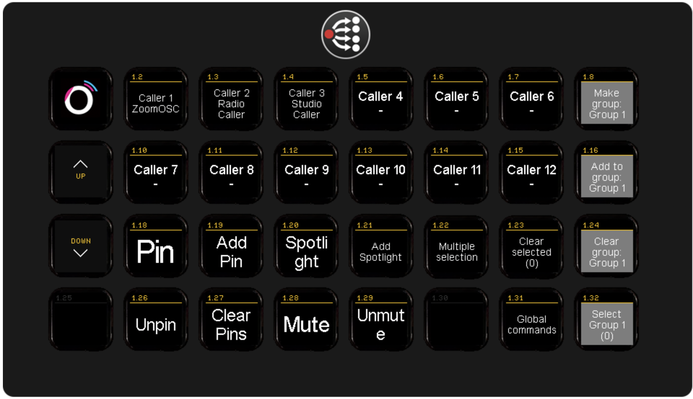
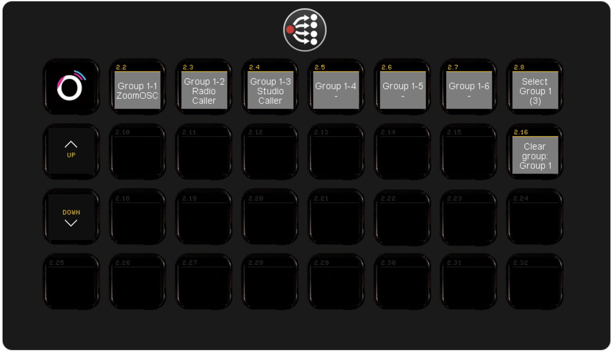
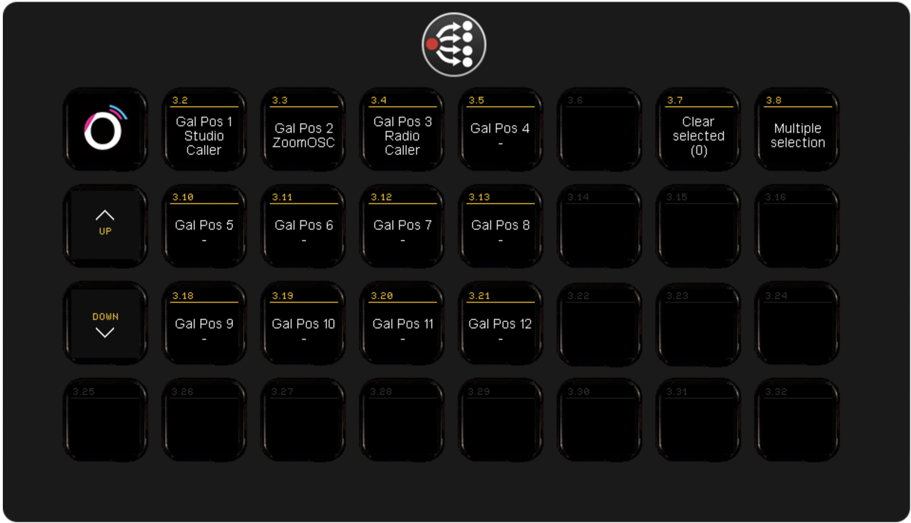

## ZoomOSC/ISO module

This module is rebuild for the new version (> 4.0.5) of Zoom OSC/ISO.

It is mainly based on the principle of selecting a caller or caller group first and then do an user action. Most of what you need you'll find in the presets. Of course you can use Global actions also

### Selection of participants

For example; drag some participants to your streamdeck like the image below. Add some user actions to it. Make sure you have the buttons for multi or single selection modus on your deck.

On the image you'll see Make group and Add to group. You can pre-select participants into groups and see then back on a new page on the deck. This way you can create for example 3 panels in a session.

The other way of quickly selecting participants can be done via Gallery view. Drag those presets on the deck correponding to the galleryview of ZoomOSC/ISO. Quick selection is now posible.

### Gallery
>> Please make sure you have Participant Reporting set to ZoomID in ZoomOSC Client.
If Gallery order is not coming into the deck try to change the order by dragging a window to a different position. This will force the client to send a update.

## FEEDBACK
In the standard presets you will find feedback for;
* Microphone live/hot
* Selected
* Active speaker
* Handraised

There is also an option for camera on.