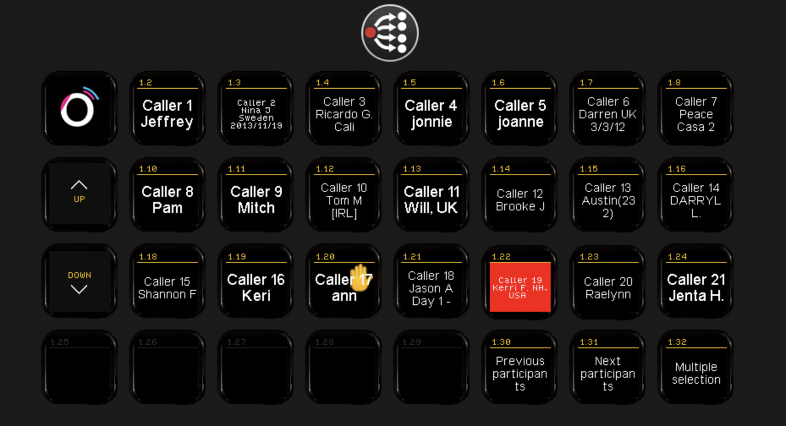
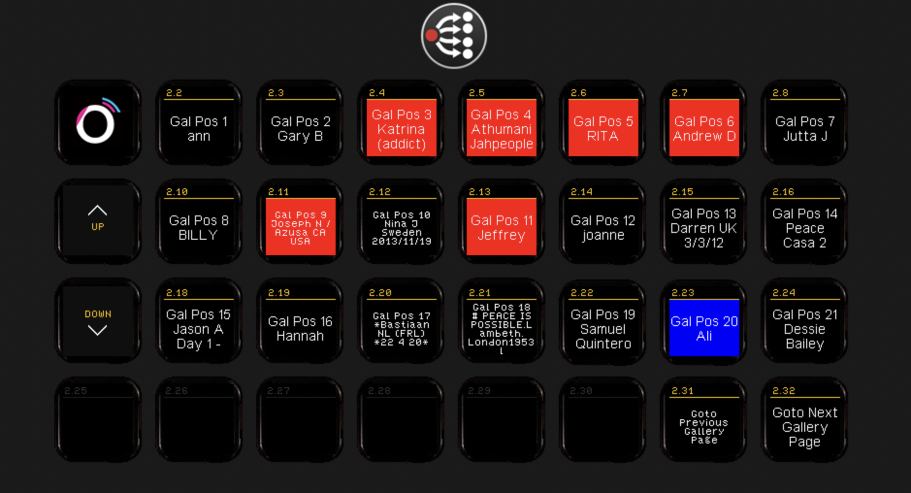

## ZoomOSC/ISO module

This module is rebuild for the new version (> 4.0.5) of Zoom OSC/Zoom ISO V2.

It is mainly based on the principle of selecting a caller or caller group first and then do an user action. Most of what you need you'll find in the presets. Of course you can use Global actions also.

### Selection of participants
There is a multi or single selection mode. This option is settable in the config or with the predefined presets. This way easy selection is possible.
There are 4-ways of selecting a participant;

#### Selection by username
> Manually fill in the name, to use for example when name is already known. 'me' is also possible

#### Selection based on index from participants coming in
> The buttons will autopopulate themselfs. Have a few of these buttons on your streamdeck and use the previous/next presets to cycle through them.

#### Selection based on Gallery view
> Works almost the same as selection based on index. Only now the order of the participant on your streamdeck is based on the gallery view. When you match you Gallery layout to your streamdeck, easy selection is posible.

#### Selection based on a group
> By using the group option you can select a group of predefined participants (more info below about groups)

Use the add to group options to add participants to a group.

### Feedback
You will find feedback for;
* Microphone live/hot
* Selected
* Active speaker
* Handraised
* There is also an option for camera on.