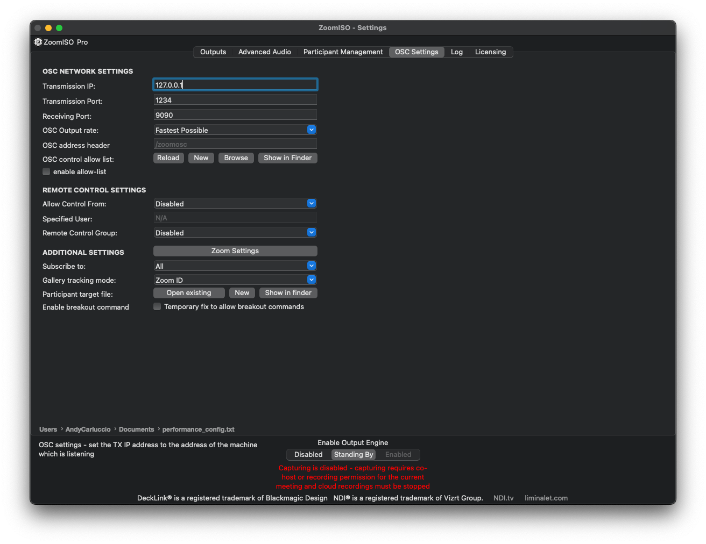
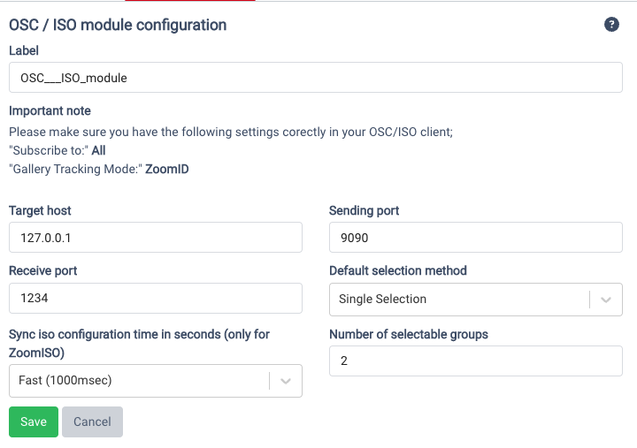
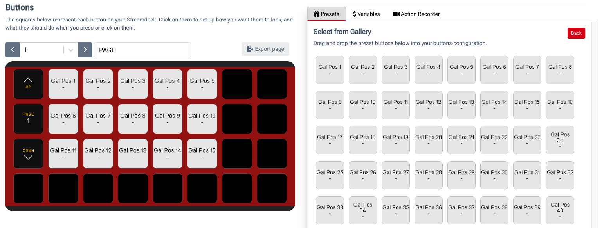
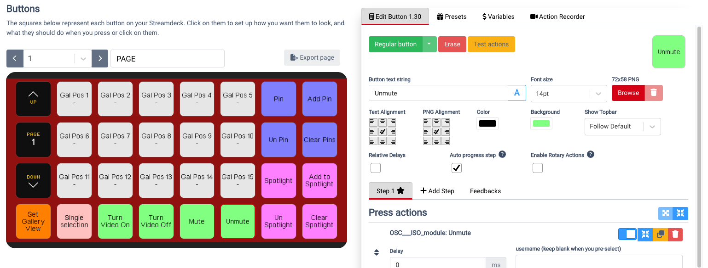
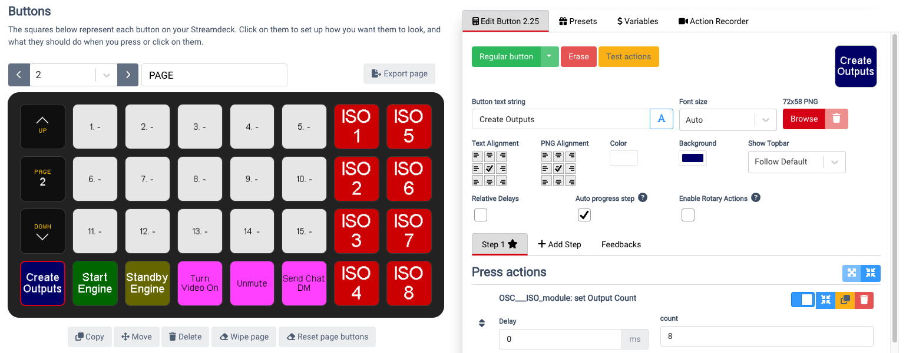
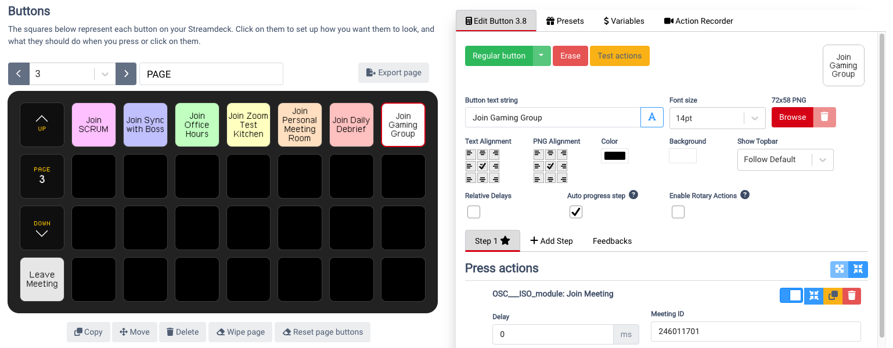

# Introduction

This module gives you deep control of Zoom from the convenience of controllers like the StreamDeck. Powered by ZoomOSC and ZoomISO, this module provides a bidirectional link to Zoom so that you can see the names of participants on the keys of your controller, and manage them effectively. This is a zero-code solution, so you don’t need to research any APIs. Everything is drag-and-drop from the module presets collection. Advanced users can build their own buttons with the actions and feedback available in this module directly without implementing the API commands for ZoomOSC and ZoomISO themselves.

# Setup

You are required to use a licensed version of ZoomOSC or ZoomISO when working with this module. The minimum versions that are compatible with this module are ZoomOSC 4.2 and ZoomISO 2.0.6. You can learn more about these products at [https://liminalet.com](https://liminalet.com)

In the OSC Settings of ZoomOSC or ZoomISO, configure the following settings:

- Transmission IP should be the IP address of the computer where companion is running (or 127.0.0.1 if Companion is running on the same computer as ZoomOSC/ISO)
- Transmission port should be an available port number that you will have Companion listen to
- Receiving port will be the available port that ZoomOSC/ISO will receive commands on from Companion
- OSC Output Rate should be set to Fastest Possible
- You cannot modify the OSC address header when using this module
- “Subscribe to” should be set to All in most cases
- Gallery Tracking Mode (or Participant Reporting) should be set to Zoom ID

In the settings of the ZoomOSC/ISO Module in Companion:

- Target host should be the IP of the computer where ZoomOSC/ISO is running (or 127.0.0.1 if they are on the same computer)
- Sending Port should be identical to the Receiving Port in ZoomOSC/ISO
- Receive Port should be identical to the Sending Port in ZoomOSC/ISO
- Default selection method governs if the module will allow you to select multiple participants or just one at a time by default, though this can be changed using a button at any point
- Sync ISO Configuration time determines how quickly the module will poll ZoomISO for its output configuration.
- Number of selectable groups determines how many groups will be available within the module. This automatically creates variables and presets for those groups.

# Basic Workflow Paths and Use Cases

There are many possible use-cases for this module. While not exhaustive, a few possible workflows are described below. In general, the module is designed for the following control pattern:

First select user(s), then apply action(s).

## Moderating Zoom

Managing the participants in a Zoom meeting often involves hunting through sub-menus or drop down lists, and this can be inefficient at scale, especially during quick transitions. With the ZoomOSC/ISO module, you can create a control surface for Zoom that is optimized for this use case. You can leverage the gallery-based participants list to make sure that the buttons automatically contain the names of the most relevant participants. Feedback available on the preset buttons will automatically change color based on video and audio status, and display a hand-raised icon.

### Setting Up Moderating Zoom

1. Under Presets open the “Select from Gallery” category. Drag the buttons onto your StreamDeck, leaving room on the sides and bottom for actions!

   

1. Set ZoomOSC/ISO to gallery view. It is important to remain in gallery view while using these buttons. You can resize the Zoom window so the number of rows and columns in the gallery view match the arrangement of gallery buttons on your StreamDeck.
1. Explore the other preset categories and add action buttons for managing pin, spotlight, video, mute, etc. Add buttons to return to gallery view and toggle selection method. You can adjust the background color and key styling as needed.

   

1. To operate the page, you can select participants (their names will automatically appear based on the order of the gallery view) and then pick an action to apply to that individual or group.

## ZoomISO Configuration

ZoomISO can be controlled by this module to allow you to route participants to video outputs and audio channels easily. You can also change ZoomISO’s settings from this module, including control of the number of outputs and the state of the engine. For advanced users, the outputs and channels of ZoomISO are also selectable, so you can select participants and outputs in any order, and then match them to each other like a traditional video matrix.

### Setting Up ZoomISO Configuration

1. Under Presets open the “Select from Participants” category. Drag the buttons onto your StreamDeck, leaving room on the sides and bottom for actions

2. Ensure Companion is in single selection mode. We will assume ZoomISO has 8 outputs in this example. Output properties can be configured by Companion, or through the ZoomISO UI. Make sure that ZoomISO has the necessary permissions for raw data access.

3. Under the preset category "ZoomISO Actions" drag 8 copies of the button called “Set User to Output” and place them on the right side of the StreamDeck. Change the Output field of each button so it targets a unique ZoomISO output and rename the keys accordingly. You can also drag buttons for managing other ZoomISO properties, as well as some meeting management functions that could be helpful in combination with ZoomISO.
4. To operate the page, select a participant and tap on an output to change who is being sent out of the ZoomISO outputs.

## Personal Controls

The ZoomOSC/ISO module is a great way to manage your own settings and controls within a Zoom call as a participant. Many of the actions can be configured to act upon your local settings, making it much easier to configure certain functions like audio and video controls without needing to navigate any menus. The Join Meeting button allows you to enter your recurring meetings and easily join them with a single button press. Together these actions can be an ergonomic management solution for self-participation in Zoom.

### Setting Up Personal Controls

1. Under Presets select “Join/Leave/End Actions” and drag several copies of the “Join Meeting” button. Drag over a Leave Meeting button as well.
1. You can set a custom name for each button, and enter the Meeting ID, Password, and your Display Name into each button. You can use custom colors, or even upload your own images to represent the different meetings you want to access. Remember to sign into ZoomOSC/ISO if these meetings require registration.
1. Return to Presets and drag buttons from “Video/Audio Actions” as well as “Devices & Settings Actions” onto your StreamDeck. For each button, set the properties appropriately. Importantly, in the username field, enter “Me” to make the button reference yourself. This is a macro keyword that will always reference you, regardless of your Zoom display name.

   

## Selections and Groups

Selections are a key component of this module. With names of Zoom participants automatically appearing on your keys, selections allow you to designate which users to act upon. There are many workflows for selection, including single-selection, multi-selection, and groups.

### Select from Participants

This is a Preset Category of buttons as well as a variable reference representing the participants in the meeting in a largely static list. The order of members in the list will not generally change unless ZoomOSC/ISO leaves and rejoins the meeting. New participants are added to the end of the list, and participants who leave the meeting are removed from the list (decrementing the indices of subsequent users in the list). You can apply a global offset to the group indices using the Next Participants and Previous Participants actions.

Select from Participants is helpful when you don’t want your buttons to automatically change which participants they are tied to because of in-meeting actions by the participants. It is a simple list without many external behavior associations or dependencies, which makes it helpful in many use cases.

### Select from Gallery

This is a Preset Category of buttons as well as a variable reference representing the participants in the meeting based upon their order in the Gallery View of ZoomOSC/ISO (linearized top left to bottom right). This list will change order automatically based on any of the factors that can influence the gallery view order, including hand raising, speaking, enabling video, manual reorder, pagination, resizing, and more. The list will never contain more members than those visually represented on screen in the Zoom Gallery View, so it has a maximum length of 49. It is essential that ZoomOSC/ISO be in gallery view in order for this list to be accurate.

Select from Gallery is helpful for having a visual correspondence between the buttons and the Zoom interface, especially if the Zoom window is resized so that both the StreamDeck and the Gallery View have the same arrangement of participants in terms of rows and columns. Furthermore, the behaviors that influence the order of the Zoom Gallery View often correspond to the relevancy of those participants to the meeting, making it easy to find key individuals to act upon without requiring an extensive search.

### Single vs Multi Selection Mode

The module has a concept of a selection mode that can be set to either Single Selection or Multi Selection. In Multi Selection mode, you can tap on a participant once to select them, and then tap on them again to deselect them. In Single Selection mode, tapping on a participant will select them and automatically deselect any previous selection.

For actions that can be applied to many participants at once, Multi Selection is helpful, whereas for actions that can only function on a single participant, Single Selection is ideal.

### Selection Management and Action References

By default, most actions will act upon the selected participants. You can override this behavior by entering a username of the participant to act upon, or entering the macro string “Me” to reference your personal user. If the username field is blank, the module will reference the selection. If the action only accepts one participant, but multiple participants are selected, the action will be taken on the first user to be selected.

The module respects the order of selections, so when acting on multiple participants, the actions will first be taken on the first members to be selected, and then finish with the participants most recently added to the selection. This is important for commands like Add Spotlight, where the order of selection will determine the visual order of the spotlit users.

There are several variables and actions to help you manage the selection process available in the module. For example, since actions do not automatically deselect the participants acted upon, you can add a “Clear Selections” action to deselect them.

### Groups

One of the most powerful features of this module is the ability to place participants into groups. Just like participants, groups are referenceable and selectable. You can index into groups with variables to display their members. In fact buttons with these properties are automatically available in the Presets area under “Manage Selections and Groups” by automatically generating new buttons based on the number of groups specified in the module setup.

Groups can have a variety of purposes. For example, you might make a group called “Favorites” that contains the subset of users in your meeting that you will actually need to interact with. Then, you could have a page that shows who is in the Favorites group so you can select them and act upon them individually or together. Alternatively, you could have several groups representing the members of different panel conversations. Once the users are placed in the different panelist groups, you can select all members of a panel at once simply by selecting the corresponding group itself, and applying an action like Add Spotlight to the entire group.

There is a default group called “Hosts” created and managed by the module itself. Its members are the host and co-host(s) of the meeting. This membership is automatically managed, so you cannot add or remove members (unless you change who the host and co-host(s) are) or change the group properties.

# Variables and Feedback

This module supports many variables and feedback properties. These are helpful for automatically changing key properties like the name and color of a button. Variables can also be used for basic automation systems in the Triggers workflow within Companion. Most preset buttons already contain the necessary feedback and variable mapping for dynamic buttons, but advanced users may wish to read deeper into the module to build customized buttons and workflows.

# Support and Thanks

The ZoomOSC/ISO Companion Module is not an official Zoom product. It is a community-driven project that utilizes the Open Sound Control public APIs of ZoomOSC and ZoomISO. While Zoom (and formerly Liminal) have designed its behavior, they hold no liability for this module or its upkeep. Ultimately it is managed by and the responsibility of the open-source Companion community, BitFocus, and its users.

For support on this module, please utilize the GitHub and Slack for BitFocus Companion. If you have questions on ZoomOSC or ZoomISO, you can email [info@liminalet.com](mailto:info@liminalet.com) for Zoom’s official support of those products.

This module is the result of several years of effort from multiple individuals and teams. This version of the module was created by Jeffrey Davidsz and designed by Andy Carluccio and Jonathan Kokotajlo from Zoom, the former co-founders of Liminal. The team is grateful for the work of several contributors to previous iterations of the module including Ash Green, Richard Williamson, Benjamin Antupit, and Johnny Estilles. The team would also like to thank the power users and beta testers whose contributions to the module have helped shape it over the years, with special recognition to Jeff Widgren, David Paskin, and Justin James.
